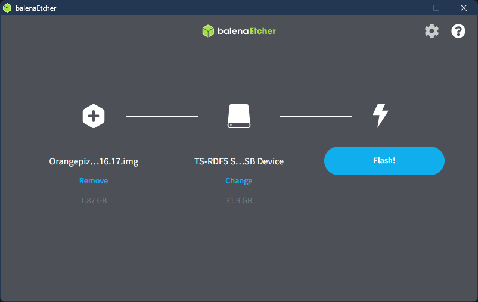
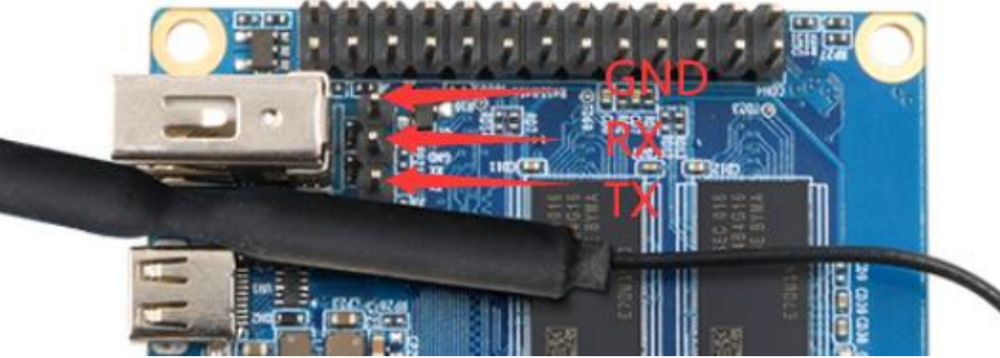
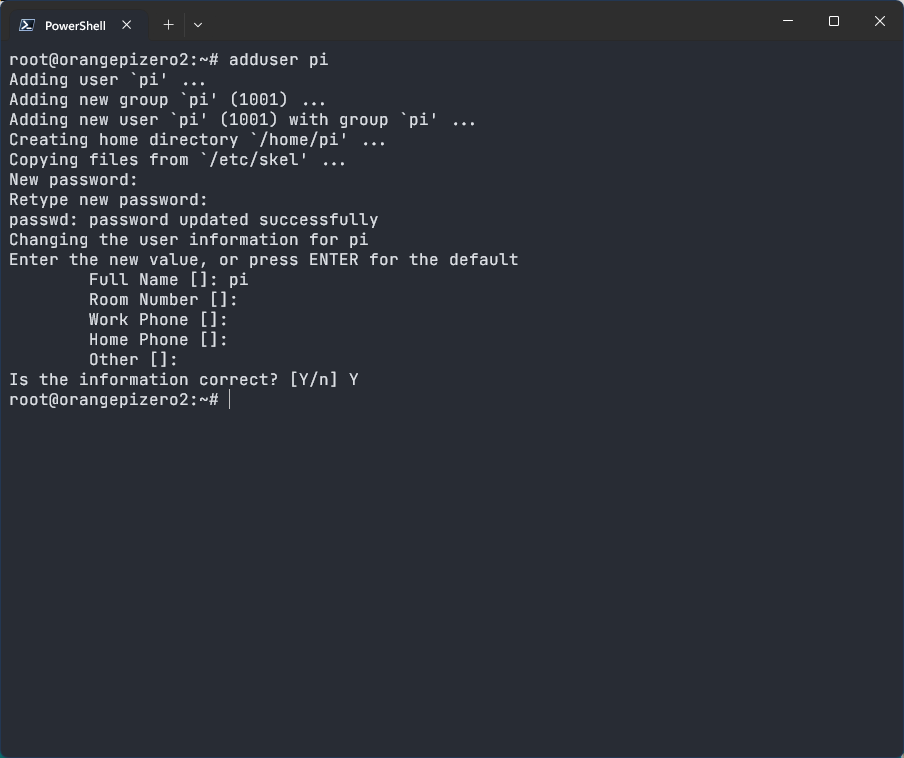
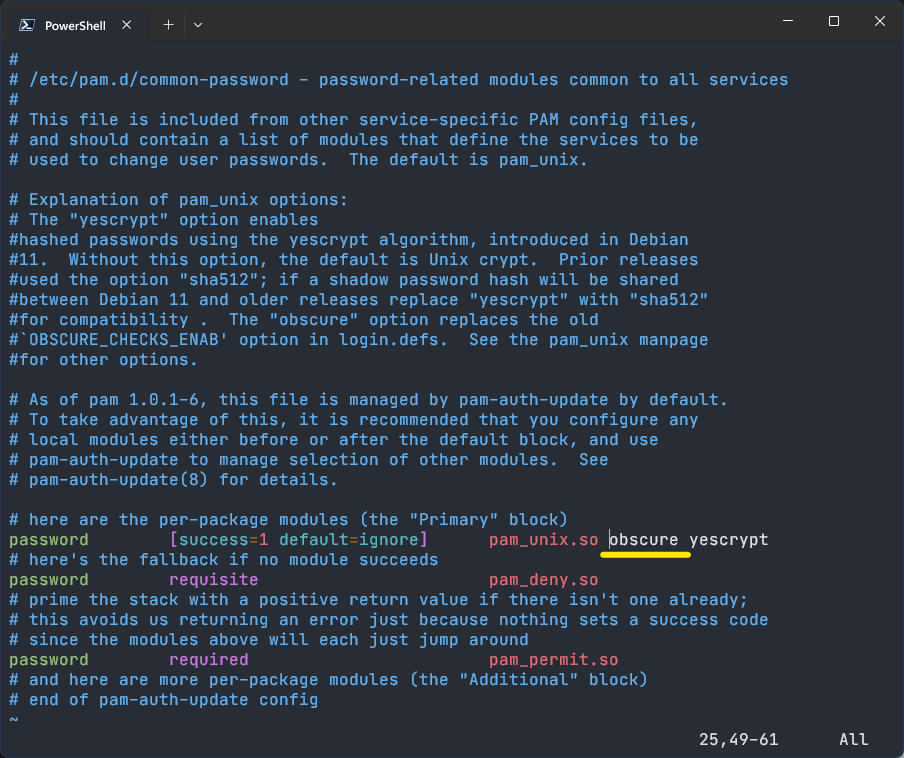
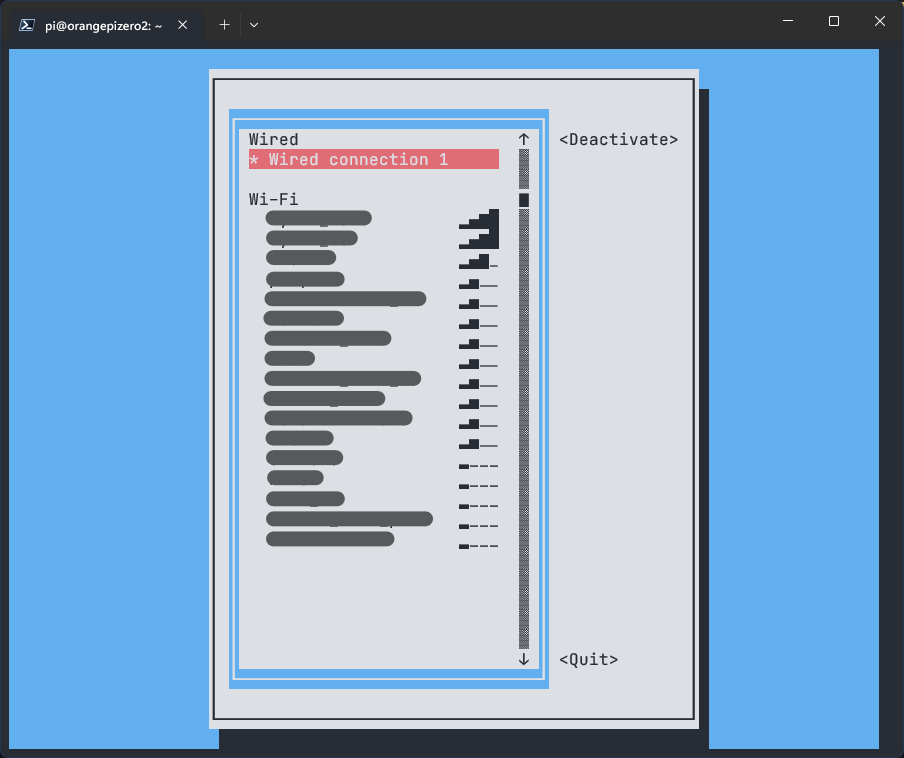
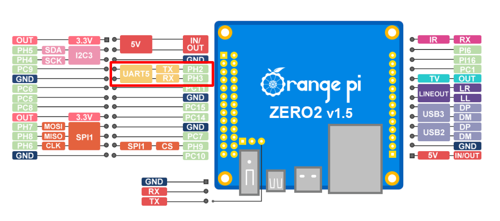

# Install Klipper on Orange Pi Zero 2

Due to the lack of Raspberry Pi at a reasonable price, I'm looking for some alternative SBC to run klipper on it.
Orange Pi Zero 2 is a good choice. It has a quad-core CPU, 1GB of RAM, and built-in dual-band WIFI support.

Here is how I get klipper running on the Orange Pi Zero 2. I mostly only cover the parts specific to Orange Pi Zero 2 here. There are plenty of tutorials for installing klipper out there, e.g. videos by [NERO 3d](https://www.youtube.com/playlist?list=PL7zrGeKp_8CRmVTuBaUQcHKlS9bJRU6vT) or [Teaching Tech](https://www.youtube.com/playlist?list=PLGqRUdq5ULsPpXumOwd87C-8LI_WXLz0n).

Please refer to the user manual on [orangepi.org](http://www.orangepi.org/html/hardWare/computerAndMicrocontrollers/service-and-support/Orange-Pi-Zero-2.html) for more detail about setting up the Orange Pi Zero 2.

Also note that some part of this instruction have not been thoroughly tested and your mileage may vary.

## Prepare the Operating System

The recommended OS is Debein from [orangepi.org](http://www.orangepi.org/html/hardWare/computerAndMicrocontrollers/service-and-support/Orange-Pi-Zero-2.html).
I've tried several versions of [armbian](https://www.armbian.com/orange-pi-zero-2/) but couldn't get WIFI to work.

I'm running the newest version of Debian server `Orangepizero2_3.0.6_debian_bullseye_server_linux5.16.17` as of the time of writing.

### Flash the SD card

The process is basically the same as flashing Raspberry Pi OS. I recommend using the tool [belenaEtcher](https://www.balena.io/etcher/). It's available on Windows, macOS, and Linux.

The installation is quite straight forward. Download the OS image and extract the `.img` file from the `.7z` file. Get the micro SD card plugged in to your computer.
Finally, launch balenaEtcher, choose the correct image file and storage, press **Flash!**, and it will take care of all the rest.



### First Boot and Setup

To do the setup, you have to access the Orange Pi either through SSH, or have a monitor and keyboard attached.

1. SSH through ethernet

   The Orange Pi has to be connected to the router through the ethernet port.

   Look up the IP address assigned to the Orange Pi in the setting webpage of your router.
   If you don't have access to the router's setting, you can use some port scanning tool like [Angry IP Scanner](https://angryip.org/) and scan for port 22 on the local network.

   Use your preferred SSH client to connect to the Pi: `ssh root@[IP address of your Pi]`.
   (If it asks for something about fingerprint, type `yes` and press `Enter`.)

2. SSH through debug serial port

   Use a 3.3V USB to TTL module to connect to the debug serial pins on the board.

   

   Find the serial port of the USB to TTL module on your PC (it depends on the OS you are using) and connect SSH through that port with baudrate 115200.

#### Login and Setup the User

1. Login to user *root* with the default password *orangepi*.

2. Change the default password for better security by running `passwd`.

3. Update the system packages with `apt update --allow-releaseinfo-change && apt dist-upgrade`.

4. To prevent possible issues with scripts written for Raspberry Pi, create a new user *pi* by running `adduser pi` and set the password for it.

   

   *Tip: By default Debian will not let you use a simple password. You can disable the password check by editing `/etc/pam.d/common-password` and remove the option `obscure`. You are responsible for the risk by doing so.*

   

5. Give *pi* the permission to run commands as root by adding it to the group *sudo* with `adduser pi sudo`.

6. (Optional) Remove the default user *orangepi* with `userdel -r orangepi`.

7. Switch to the user *pi* by running `su -l pi` or reboot and login as *pi*.

#### Connect to WIFI

Run the command `nmtui-connect` and a list of available WIFI should appear.
Select your SSID and enter your WIFI password.



If there is no WIFI showing up, it might be the WIFI driver is not working. Try another version of OS and do some searching.

### Install the Required Software

We need to have [klipper](https://www.klipper3d.org/), [Moonraker](https://moonraker.readthedocs.io/en/latest/), and one of the clients ([Mainsail](https://docs.mainsail.xyz/), [Fluidd](https://docs.fluidd.xyz/), or [Octoprint](https://octoprint.org/)) installed to make it functional.

There are two ways to do the installation:

1. Use [KIAUH](https://github.com/th33xitus/kiauh) (Recommended).

   Follow the instructions to run the script, and use the *Install* menu to install klipper, Moonraker, and one frontend.

2. Manual install.

   There is a good guide on [Mainsail's document](https://docs.mainsail.xyz/setup/manual-setup).

## Setup klipper

If the software installation goes well, the web interface should show up in your browser at `http://<IP address of your Pi>` .

Now you can follow the [klipper documentation](https://www.klipper3d.org/Installation.html) to finish the configuration process for your printer.

### Connect to MCU through UART Pins

You can use the UART pins on the 26-pin header to communicate with the MCU.



1. Enable the UART5 interface.

    Add the following line to the end of the file `/boot/orangepiEnv.txt`:

    ```txt
    overlays=uart5
    ```

2. Edit the `printer.cfg` and use `serial: /dev/ttyS5` in the `[mcu]` section.


### Use Orange Pi as a MCU

1. Follow the instructions on [klipper's document](https://www.klipper3d.org/RPi_microcontroller.html) to flash the klipper_mcu.

2. Enabling SPI (Optional):
   Add the following lines to the end of the file `/boot/orangepiEnv.txt`:

   ```txt
   overlays=spi-spidev
   param_spidev_spi_bus=1
   param_spidev_spi_cs=1
   ```

3. Enabling I2C (Optional):
   Add the following line to the end of the file `/boot/orangepiEnv.txt`:

   ```txt
   overlays=i2c3
   ```

## Acknowledgement and Related Links

- [Tutorial video by Michael ODonnell](https://www.youtube.com/watch?v=gle8Z2rA2ZA)
